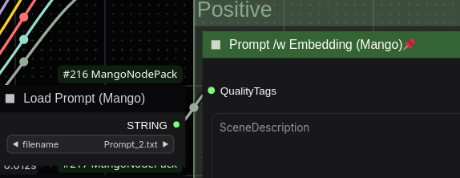
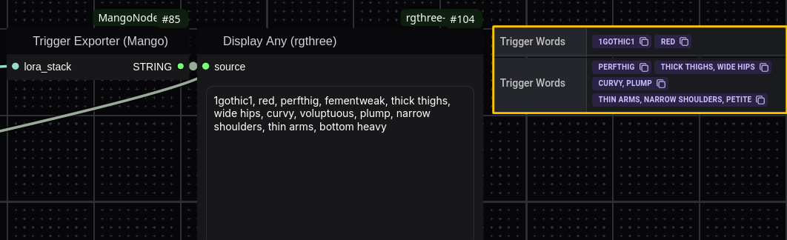
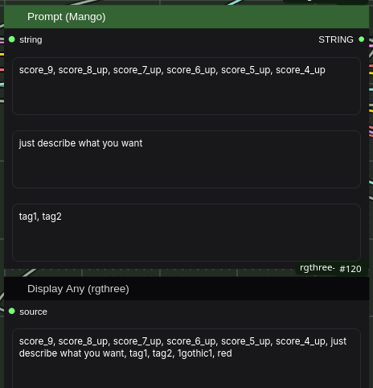
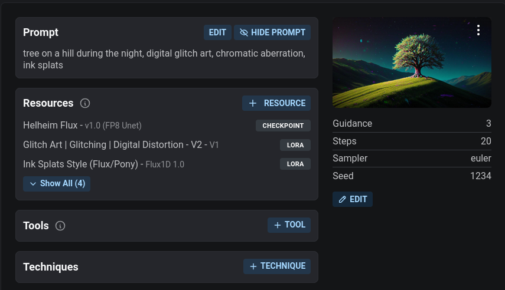
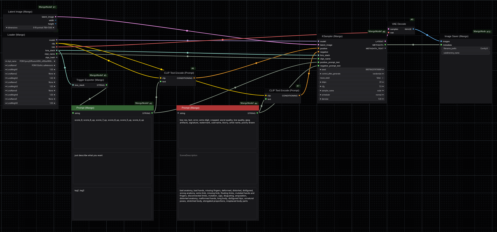

# ComfyUI MangoNodePack

*A collection of enhanced nodes for ComfyUI with metadata handling for Civitai and streamlined model loading.*

---

## 🚀 **NEW NODES**

👉 **Prompt Saver** – Don't lose your prompts ever again, by saving their copy in the output folder (or specified subfolder).\
👉 **Prompt Loader** – Load saved prompts easily from the dropdown list, and connect to the Positive/Negative nodes.



---

## 🚀 **UPDATE - FLUX NODES**

👉 **Diffusion Model Loader** – Like SDXL/PONY version, it loads model along with clips and LoRAs, extracting metadata and and passing them as string.\
👉 **FLUX Sampler** – Metadata tracking with LoRA and checkpoint integration.\
👉 **FLUX Guidance** – The very same FLUX Guidance as ComfyUI original, but with guidance extraction to save as metadata.

Known issue: Occasionally, not every LoRA will be visible on Civitai as the hash will not be recognized correctly. It's most likely caused by models' updates on Civitai, and re-downloading the model solves the issue.

---

## 🚀 **Features**

👉 **LoRA Metadata Exporter** – Extracts trigger words from LoRA metadata (local & online).\
👉 **Prompt Formatters** – Organizes quality tags, descriptions, and prompt structure.\
👉 **Smart Model Loader** – Loads models and LoRAs with automatic metadata extraction.\
👉 **Enhanced KSampler** – Improved metadata tracking with LoRA and checkpoint integration.\
👉 **Advanced Image Saver** – Saves images with embedded metadata, filenames, and auto-numbering.\
👉 **Custom Latent Generator** – Predefined resolutions for common aspect ratios.

---

## 💽 **Installation**

### **Requirements**

- **ComfyUI** installed and running.
- Python dependencies (install via terminal):
  ```sh
  pip install safetensors
  ```

### **Installation Steps**

Find Mango Node Pack in the ComfyUI Manager!

OR

1. Clone the repository:
   ```sh
   git clone https://github.com/mang01010/MangoNodePack.git
   ```
2. Move the `MangoNodePack` folder into ComfyUI’s `custom_nodes` directory.
3. Restart ComfyUI to load the new nodes.

---

## 📝 **Node Overview**

### **1️⃣ Trigger Exporter (Mango)**

💡 **Category:** Metadata

- The pack started with this node. It extracts trigger words from LoRAs and concatenates them as comma delimited string that can be pushed further, so you won't have to think about these. Don't fail using downloaded LoRA ever again!



### **2️⃣ Prompt (Mango)**

💡 **Category:** Metadata

- This node organizes prompts into three separate text boxes, making them easier to read and edit. It also supports direct integration with the Trigger Exporter.



### **3️⃣ Prompt /w Embedding (Mango)**

💡 **Category:** Metadata

- Does the same thing as Prompt (Mango), but divides prompt further to add embeddings in seperate field.

### **4️⃣ Loader (Mango)**

💡 **Category:** Loaders

- Loads Stable Diffusion models and up to 5 LoRAs.
- Computes model hashes and applies LoRAs with weight control.

### **5️⃣ KSampler (Mango)**

💡 **Category:** Sampling

- This version of the KSampler node features eight inputs. The standard inputs—model, latent image, positive, and negative—are used for image generation. Additionally, it includes a LoRA stack, checkpoint name, and separate positive and negative text fields as a metadata workaround for:

### **6️⃣ Image Saver (Mango)**

💡 **Category:** Metadata

- Saves images with embedded metadata (prompt, seed, CFG, steps, sampler, checkpoint and LoRAs info), ensuring compatibility with Civitai for direct metadata reading.
- Supports auto-numbering and custom subdirectories.



### **7️⃣ Latent Image (Mango)**

💡 **Category:** Loaders

- Generates latent tensors in predefined aspect ratios (e.g., 1:1, 16:9, etc.).

---

## 🛠 **Usage Guide**

Once installed, find the **MangoNodePack** nodes inside ComfyUI.

**Example Workflow:**



---


## 📝 **License**

This project is licensed under the MIT License – see the [LICENSE](LICENSE) file for details.


---
### **📢 Check out these awesome node packs!**  
- [ComfyUI](https://github.com/comfyanonymous/ComfyUI)  
- [rgthree-comfy](https://github.com/rgthree/rgthree-comfy)
- [Efficiency-Nodes](https://github.com/jags111/efficiency-nodes-comfyui)
- [ComfyUI Comfyroll Custom Nodes](https://github.com/Suzie1/ComfyUI_Comfyroll_CustomNodes)  
- [ComfyUI Custom Scripts](https://github.com/pythongosssss/ComfyUI-Custom-Scripts)  
- [WAS Node Suite](https://github.com/WASasquatch/was-node-suite-comfyui)
- [Easy-Use](https://github.com/yolain/ComfyUI-Easy-Use)
- [PRNodes](https://github.com/pikenrover/ComfyUI_PRNodes) 

