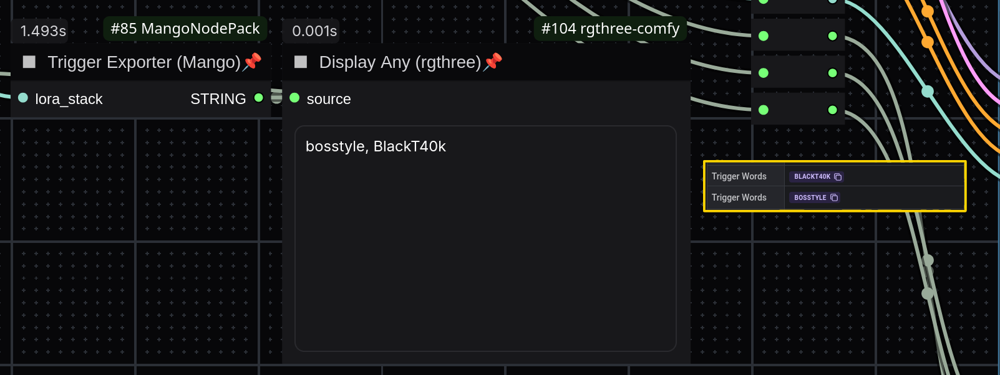

# ComfyUI MangoNodePack

*A collection of enhanced nodes for ComfyUI with metadata handling for Civitai and streamlined model loading.*

---

## 🚀 **Features**

👉 **LoRA Metadata Exporter** – Extracts trigger words from LoRA metadata (local & online).\
👉 **Prompt Formatter** – Organizes quality tags, descriptions, and prompt structure.\
👉 **Smart Model Loader** – Loads models and LoRAs with automatic metadata extraction.\
👉 **Enhanced KSampler** – Improved metadata tracking with LoRA and checkpoint integration.\
👉 **Advanced Image Saver** – Saves images with embedded metadata, filenames, and auto-numbering.\
👉 **Custom Latent Generator** – Predefined resolutions for common aspect ratios.

---

## 💽 **Installation**

### **Requirements**

- **ComfyUI** installed and running.
- Python dependencies (install via terminal):
  ```sh
  pip install safetensors
  ```

### **Installation Steps**

1. Clone the repository:
   ```sh
   git clone https://github.com/mang01010/MangoNodePack.git
   ```
2. Move the `MangoNodePack` folder into ComfyUI’s `custom_nodes` directory.
3. Restart ComfyUI to load the new nodes.

---

## 📝 **Node Overview**

### **1️⃣ Trigger Exporter (Mango)**

💡 **Category:** Metadata

- The pack started with this node. It extracts trigger words from LoRAs and concatenates them as comma delimited string that can be pushed further, so you won't have to think about these. Don't fail using downloaded LoRA ever again!



### **2️⃣ Prompt (Mango)**

💡 **Category:** Metadata

- This node organizes prompts into three separate text boxes, making them easier to read and edit. It also supports direct integration with the Trigger Exporter.


### **3️⃣ Loader (Mango)**

💡 **Category:** Loaders

- Loads Stable Diffusion models and up to 5 LoRAs.
- Computes model hashes and applies LoRAs with weight control.

### **4️⃣ KSampler (Mango)**

💡 **Category:** Sampling

- This version of the KSampler node features eight inputs. The standard inputs—model, latent image, positive, and negative—are used for image generation. Additionally, it includes a LoRA stack, checkpoint name, and separate positive and negative text fields as a metadata workaround for:

### **5️⃣ Image Saver (Mango)**

💡 **Category:** Metadata

- Saves images with embedded metadata (prompt, seed, CFG, steps, sampler, checkpoint and LoRAs info), ensuring compatibility with Civitai for direct metadata reading.
- Supports auto-numbering and custom subdirectories.


### **6️⃣ Latent Image (Mango)**

💡 **Category:** Loaders

- Generates latent tensors in predefined aspect ratios (e.g., 1:1, 16:9, etc.).

---

## 🛠 **Usage Guide**

Once installed, find the **MangoNodePack** nodes inside ComfyUI.

**Example Workflow:**


---


## 📝 **License**

This project is licensed under the MIT License – see the [LICENSE](LICENSE) file for details.


---
### **📢 Check out these awesome node packs!**  
- [ComfyUI](https://github.com/comfyanonymous/ComfyUI)  
- [rgthree-comfy](https://github.com/rgthree/rgthree-comfy)  
- [ComfyUI Comfyroll Custom Nodes](https://github.com/Suzie1/ComfyUI_Comfyroll_CustomNodes)  
- [ComfyUI Custom Scripts](https://github.com/pythongosssss/ComfyUI-Custom-Scripts)  
- [WAS Node Suite](https://github.com/WASasquatch/was-node-suite-comfyui)  
- [PRNodes](https://github.com/pikenrover/ComfyUI_PRNodes) 

